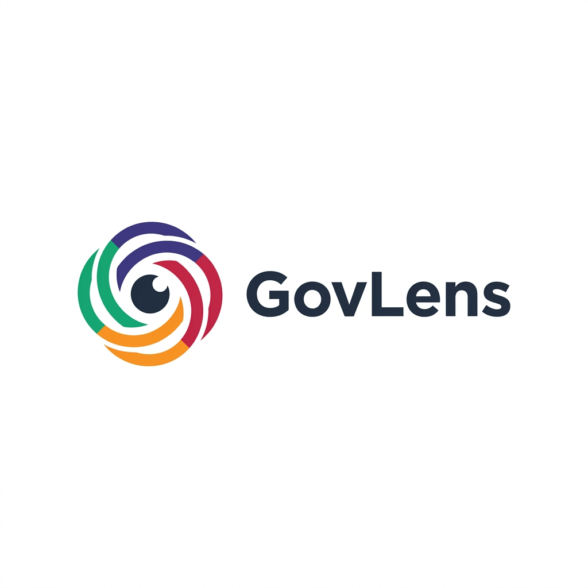

<p align="center">
    
</p>

# GovLens - Plataforma de Governança e Maturidade de TI

O **GovLens** é uma aplicação web desenvolvida para auxiliar empresas no diagnóstico e acompanhamento de sua maturidade tecnológica. Através de questionários estruturados e indicadores precisos, a plataforma oferece uma visão clara da governança atual e um roadmap para a evolução estratégica.

## 🚀 Principais Funcionalidades

- **Avaliações de Maturidade:** Questionários baseados em frameworks de mercado.
- **Relatórios Detalhados:** Visualização de pontuação por categoria e sugestões de melhoria automática.
- **Níveis de Evolução:** De "Artesanal" a "Estratégico".
- **Gestão de Empresas e Usuários:** Controle completo de acesso e multi-tenant.

## 🛠️ Tecnologias Utilizadas

- **Backend:** Laravel 11.x
- **Frontend:** Vue.js 3 com Inertia.js
- **Styling:** Tailwind CSS
- **Banco de Dados:** PostgreSQL (Supabase)
- **Containerização:** Docker & Railway

## 📦 Instalação

1. Clone o repositório.
2. Copie o arquivo `.env.example` para `.env` e configure suas variáveis.
3. Execute o Docker:
   ```bash
   docker compose up -d
   ```
4. Instale as dependências:
   ```bash
   npm install && npm run dev
   composer install
   ```

## 📄 Licença

Este projeto é software livre licenciado sob a [MIT license](https://opensource.org/licenses/MIT).
